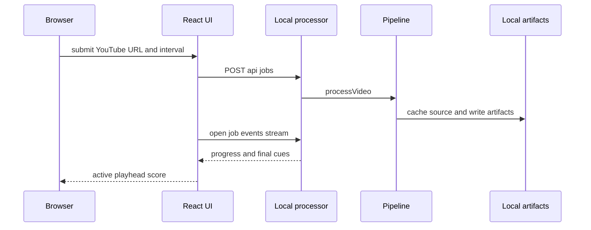

# Score Shield runtime architecture

Score Shield separates a browser-facing UI from a local media processor. The split keeps an API key and native tools out of the hosted Worker and lets the processor own local source media and artifacts. [Operations and integrations](../operations-and-integrations.md) configures these runtimes; [Score timeline workflow](../workflows/score-timeline.md) defines the transformation the processor runs.

This shows the real-processing request flow. The hosted Worker serves the UI only; it does not invoke the local processor.

## Browser interface and player

`ScoreShieldApp` in `app/page.tsx` owns landing, processing, and player views. It posts `{ sourceUrl, frameIntervalSeconds }` to `${NEXT_PUBLIC_PROCESSOR_URL}/api/jobs` (default `http://localhost:8787`) and, after the `202` response, opens `EventSource` for that job. A `complete` SSE payload supplies the cue array; the browser also builds the processor `score.vtt` URL for the download link. There is no client-side manifest fetch, reconnection strategy, or polling fallback.

`YouTubePlayer` accepts messages only from `https://www.youtube.com` and its own iframe. `PlayerScreen` uses `cueAt` to binary-search the last cue whose start is no later than `currentTime`. It writes the active score and an `in progress`/`final` status to the document title. `onEnded` makes the status final; `updateTime` clears it when playback returns before the final cue. This consumption contract depends on [ordered, complete-state cues](../workflows/score-timeline.md#output-and-playback-contract), not event deltas.

The interactive demo uses fixed `demoCues` and simulated progress, so it works without the processor or API key. The `worker/index.ts` Worker routes application traffic through Vinext and handles `/_vinext/image` using Cloudflare image transforms. It is a separate deployed surface: use `npm test`, not a processor unit test, after changing the hosted shell or build path.

## Processor lifecycle and HTTP contract

`server/index.mjs` runs a dependency-light Node HTTP server on `127.0.0.1:${PROCESSOR_PORT:-8787}`. Before creating the artifact root or listening, it calls `validateProcessorEnvironment`; a missing or whitespace-only `OPENAI_API_KEY` emits structured error output and exits. `tests/server-startup.test.mjs` specifically proves this fail-before-listening behavior.

| Endpoint | Behavior |
| --- | --- |
| `GET /health` | Returns `{ ok: true }`. |
| `POST /api/jobs` | Accepts a bounded JSON body containing an allowlisted HTTPS YouTube URL and optional whole-number `frameIntervalSeconds` from 5 through 30. Creates a UUID job, returns `202`, then begins processing asynchronously. |
| `GET /api/jobs/:id` | Returns the process-local job snapshot with progress and any final cues. |
| `GET /api/jobs/:id/events` | Opens SSE and immediately sends the current snapshot; future updates broadcast to connected clients. |
| `GET /api/jobs/:id/manifest` | Returns completed `manifest.json` for a known job. |
| `GET /api/jobs/:id/score.vtt` | Returns the completed VTT as a download for a known job. |

Jobs are retained in a `Map` and contain an SSE client `Set`; `randomUUID()` names both the registry record and its job artifact directory. CORS allows `WEB_ORIGIN` or `http://localhost:3000`. Request bodies stop at 20,000 characters. Preserve URL allowlisting, interval validation, loopback binding, bounded bodies, and argument-array subprocess use when changing this boundary.

A restart loses every job record even if its artifact files remain. There is no cancellation endpoint, authentication, rate/concurrency control, ownership model, durable queue, retry, cleanup scheduler, or reconnect fallback. These are security and operational limits, not hidden extension points; see the [quickstart backlog](../quickstart.md#backlog).

## Artifact and deployment boundaries

`processVideo` writes per-run output under `artifacts/<uuid>/`: sampled `frames/`, `observations.json`, `manifest.json`, and `score.vtt`. Source media is intentionally **not** copied into each job: the pipeline caches it at `artifacts/cache/youtube/<cache-key>/source.*` and can share an in-progress download for equivalent video identities. [The workflow page](../workflows/score-timeline.md#sampling-and-source-cache) explains that identity and concurrency behavior.

`npm run artifacts:clean` calls `cleanJobArtifacts`, which deletes only UUID-shaped directories directly under the selected artifacts root. It preserves `cache/` and unrelated directories; `tests/clean-artifacts.test.mjs` is the narrow regression test. Do not replace that command with a broad recursive cleanup.

Vite loads Vinext, the Cloudflare plugin, and `build/sites-vite-plugin.ts`, which copies `.openai/hosting.json` and `drizzle/` to `dist/.openai`. D1 and R2 bindings are currently `null`. `db/index.ts` can acquire a D1 binding, but `db/schema.ts` exports no product tables; `examples/d1/` is not part of Score Shield runtime.

## Change navigation

- **API or SSE shape:** update `server/index.mjs` and the consumer in `app/page.tsx` together. Preserve progress stage identifiers (`downloading`, `extracting`, `analyzing`, `reconciling`, `exporting`, `complete`, `failed`), then run `npm run test:unit`; add a transport test before changing error/reconnect behavior.
- **Player state:** start with `PlayerScreen`, `YouTubePlayer`, and `cueAt`. Preserve playhead-derived score and the final-status reset rule. Run `npm test` because `tests/rendered-html.test.mjs` validates the built Worker surface; browser interaction tests do not currently exist.
- **Processor exposure:** the narrow existing check is `npm run test:unit` for startup. Add focused API/security coverage before changing CORS, host binding, URL parsing, body limits, artifact routing, or subprocess handling. Public deployment is out of scope until the backlog capabilities exist.
- **Worker/build packaging:** change `worker/index.ts`, `vite.config.ts`, or `build/sites-vite-plugin.ts` with `npm test`; the build and rendered HTML test, rather than processor tests, exercise the shipped UI boundary.
