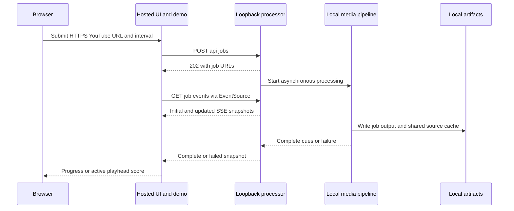
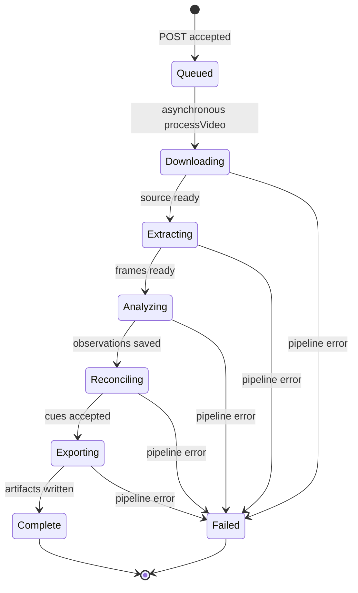

# Hosted UI and local processor architecture

Score Shield deliberately has two runtime domains. The Cloudflare-compatible Vinext application supplies the browser interface and a processor-independent interactive demo. Real video work runs in a separate Node process on the operator's machine because it needs an OpenAI key, native media tools, and writable local storage. The hosted Worker does **not** proxy to or run the processor; setting `NEXT_PUBLIC_PROCESSOR_URL` is a browser-to-processor integration decision, not a deployment mechanism for the processor.

<!-- openwiki: broken internal link [../operations-and-integrations.md] file "../operations-and-integrations.md" does not exist. Fix the href or restore the target, then delete this comment. -->
<!-- openwiki: broken internal link [../workflows/score-timeline.md] file "../workflows/score-timeline.md" does not exist. Fix the href or restore the target, then delete this comment. -->
<!-- openwiki: broken internal link [../testing-and-source-map.md] file "../testing-and-source-map.md" does not exist. Fix the href or restore the target, then delete this comment. -->
See [Score Shield quickstart](../quickstart.md) for local startup, [Local operations and integrations](../operations-and-integrations.md) for setup and retention, [Score timeline generation and spoiler-safe playback](../workflows/score-timeline.md) for the transformation and cue contract, and [Testing guidance and source map](../testing-and-source-map.md) for test selection.

## Runtime domains and entry points

| Domain | Entrypoints and ownership | What it does | What it does not do |
| --- | --- | --- | --- |
| **Hosted UI/demo** | `worker/index.ts` receives Worker requests; Vinext renders `app/layout.tsx`, `app/page.tsx`, and `/preview` from `app/preview/page.tsx`. | Serves the React product shell, accepts user input in the browser, displays progress and playhead-derived score state, and serves a simulated demo. | It has no local artifacts, no media tools, and no processor API key or job registry. |
| **Local processor** | `npm run processor` starts `server/index.mjs`; `npm run dev` starts it alongside `npm run dev:web`. | Validates the local environment, accepts loopback HTTP jobs, drives the media/AI pipeline, owns in-memory job state and local artifacts, and emits SSE snapshots. | It is not a durable queue or a supported public remote API. |

This is the real-processing control path. The browser contacts the processor URL directly; the deployed UI/demo remains usable without a processor, while the local API is bound to loopback.

### Hosted UI, player, and demo

`PROCESSOR_URL` is `NEXT_PUBLIC_PROCESSOR_URL` or `http://localhost:8787`. On the landing form, the browser performs a lightweight HTTPS-YouTube-format check, then posts `{ sourceUrl, frameIntervalSeconds }` to `/api/jobs`. After a successful response it opens `EventSource` on the returned job's `/events` URL. Every SSE message is parsed as a snapshot: the UI replaces progress, and only a `complete` snapshot supplies cues, constructs `/score.vtt`, and enters the player. A `failed` snapshot closes the stream; there is no UI polling fallback, explicit reconnection handling, manifest fetch, or client-side retry protocol.

The visible **Cancel** action only resets UI state and closes its EventSource. It does not send a request to cancel work, so an already-started local job continues. A boundary change that adds cancellation must introduce processor-side lifecycle semantics rather than treating this button as existing cancellation.

The `/preview` route renders `ScoreShieldApp` with `autoStartDemo`. Its timer simulates stages and then uses fixed `demoCues`; it makes no processor request, download, or model call. This is the public demonstration route and is intentionally separate from real processing.

The player derives the displayed score by binary-searching the latest cue whose `start` is at or before the YouTube playhead. It accepts iframe messages only when both the origin is `https://www.youtube.com` and the sender is the embedded frame. Playback completion sets the `final` label; seeking back before the final cue clears it. The browser does not enumerate future cues in the player UI, preserving the complete-state, playhead-driven spoiler boundary. The YouTube cover reduces initial disclosure, but provider chrome can still disclose source information after it is uncovered.

## Local job API and SSE lifecycle

The processor calls `validateProcessorEnvironment()` before creating the artifact root or opening its listener. A missing or whitespace-only `OPENAI_API_KEY` writes structured startup failure output and exits. With a valid key, it listens on `127.0.0.1:${PROCESSOR_PORT:-8787}` and emits CORS headers for exactly `WEB_ORIGIN` or `http://localhost:3000` by default.

| Method and path | Implemented behavior |
| --- | --- |
| `GET /health` | Returns `{ ok: true }`. |
| `POST /api/jobs` | Reads at most 20,000 characters of JSON; requires an HTTPS URL whose hostname is `youtube.com`, `www.youtube.com`, or `youtu.be`; validates an optional whole-second interval from 5 through 30; creates a UUID job; responds `202` with `id`, `statusUrl`, and `eventsUrl`; then starts processing asynchronously. |
| `GET /api/jobs/:id` | Returns the current in-memory job snapshot, including source URL, selected interval, progress, and `cues` (initially `null`). |
| `GET /api/jobs/:id/events` | Keeps an SSE response open, immediately sends the current snapshot, and sends later updates to each connected client. A closed request is removed from the client set. |
| `GET /api/jobs/:id/manifest` | Reads `manifest.json` from that known job's artifact directory. |
| `GET /api/jobs/:id/score.vtt` | Reads `score.vtt` from that known job's artifact directory as an attachment named `score-shield.vtt`. |

All normal API routes respond with the same configured CORS headers; `OPTIONS` returns `204`. Unknown job IDs return `404`. The artifact routes require the job to remain in the registry and do not themselves wait for completion—if a file is not available, the request falls through the server's error handling.

This represents progress stage values emitted through job snapshots. `complete` is set only after `processVideo` returns cues; any rejected pipeline promise leaves the job in `failed` with the error message. Initial and subsequent snapshots include `{ id, progress, cues }`, so clients must tolerate `cues: null` before completion.

### Process-local ownership and failure limits

`server/index.mjs` owns a module-local `Map` keyed by `randomUUID()` and each job owns a `Set` of open SSE responses. The UUID is also the per-job artifact directory name. Consequently, a processor restart loses job records, open streams, status access, and artifact-route authorization even though files that were already written can remain on disk. There is no durable recovery, restart reconciliation, queue, retry policy, ownership/authentication model, rate or concurrency control, automatic cleanup, or cancellation endpoint.

These limits are intentional constraints on a loopback prototype, not implicit capabilities. Do not expose this listener publicly by merely changing host, CORS, or `NEXT_PUBLIC_PROCESSOR_URL`: the startup key gate, loopback bind, single-origin CORS, request limit, HTTPS allowlist, and job lifecycle are one security boundary. Add focused HTTP/security and SSE transport tests before changing any of them; current tests cover key-gated startup but do not exercise HTTP validation, SSE reconnect/failure behavior, or cancellation.

## Artifact boundary and spoiler-safe operational signals

For a job ID, `processVideo` creates `artifacts/<id>/frames/`, saves `observations.json`, and writes `manifest.json` plus `score.vtt` only after reconciliation/export. Downloaded source media is intentionally outside that job directory: a cache key derived from normalized YouTube video identity selects `artifacts/cache/youtube/<cache-key>/source.*`. Equivalent supported URL forms for the same video can reuse that source, and a module-local promise shares an in-progress download; each job still extracts frames and regenerates observations and output independently.

The processor passes the browser final cues over SSE; the player does not read `manifest.json` or parse WebVTT. It only offers the VTT endpoint as a download after completion. Thus additions to artifacts or manifest fields are not automatically browser features—migrate the API/UI consumer deliberately if one must be displayed.

Operational logs are structured JSON and associate messages with a job ID. Pipeline progress reports stages, rounded progress, elapsed/frame-count metadata, cache events, and tool outcomes, while intentionally avoiding API keys, model responses, recognized scores, and source-video titles. Preserve that restraint: status messages and logs are user-visible or operator-visible spoiler surfaces. Pipeline failures become the `failed` snapshot message; they are not silently converted into a cue timeline.

Use `npm run artifacts:clean` only after stopping processing when removing generated runs. It deletes UUID-named job directories beneath the chosen artifact root and preserves `cache/` and unrelated entries; it is not an eviction or recovery mechanism.

## Cloudflare/Vinext build boundary

The Worker entry handles `/_vinext/image` through Vinext image optimization backed by the Worker asset fetcher and Cloudflare image transforms. Other requests go to the Vinext app-router handler, which serves the hosted UI and preview. This Worker boundary is distinct from Node's `createServer` processor and should remain free of assumptions about local filesystem paths, native executables, or `OPENAI_API_KEY`.

`vite.config.ts` loads `.openai/hosting.json`, configures Vinext plus the `sites()` and Cloudflare Vite plugins, and conditionally declares D1/R2 bindings only when the hosting configuration names them. The current hosting configuration has `d1: null` and `r2: null`, so no product persistence or artifact bucket is wired into this deployment. After Vite builds, `build/sites-vite-plugin.ts` recreates `dist/.openai` and copies the hosting configuration and `drizzle/` directory when present. Packaging those files is deployment metadata/migration handling, not evidence that the hosted Worker owns processor jobs or artifacts.

## Safe change paths and validation

- **Browser request, snapshot shape, stages, or artifact download:** change `app/page.tsx` and `server/index.mjs` together. Preserve initial SSE delivery, snapshot fields, `cues: null` before success, and the UI's complete/failed behavior. Add a focused API/SSE test first for transport changes, then run `npm run test:unit`, `npm run lint`, and `npm test` when the browser contract changes.
- **Boundary security or exposure:** start at `server/startup.mjs` and `server/index.mjs`. Preserve pre-listen key validation, loopback binding, the bounded body, HTTPS hostname allowlist, and the single configured CORS origin unless their replacements are designed and tested together. `tests/server-startup.test.mjs` verifies the existing fail-before-listening key gate; it is not coverage for the rest of this boundary.
- **Lifecycle, recovery, or cancellation:** introduce durable state, authorization, cancellation propagation, retention, and reconnect semantics explicitly across processor and UI. Do not imply support from the in-memory map, browser Cancel action, or files left after restart.
- **Spoiler-safe status/player behavior:** retain playhead-derived cue resolution, completion-only `final`, backward-seek reset, trusted iframe origin/source checks, and restrained progress/log messaging. Pair any cue-semantic change with `tests/pipeline.test.mjs`; run `npm test` when it affects the rendered player.
- **Worker, Vinext, or deployment packaging:** review `worker/index.ts`, `vite.config.ts`, `build/sites-vite-plugin.ts`, and `.openai/hosting.json` together. Run `npm run lint` and `npm test`, because `npm test` builds then imports the Worker output in `tests/rendered-html.test.mjs`.
