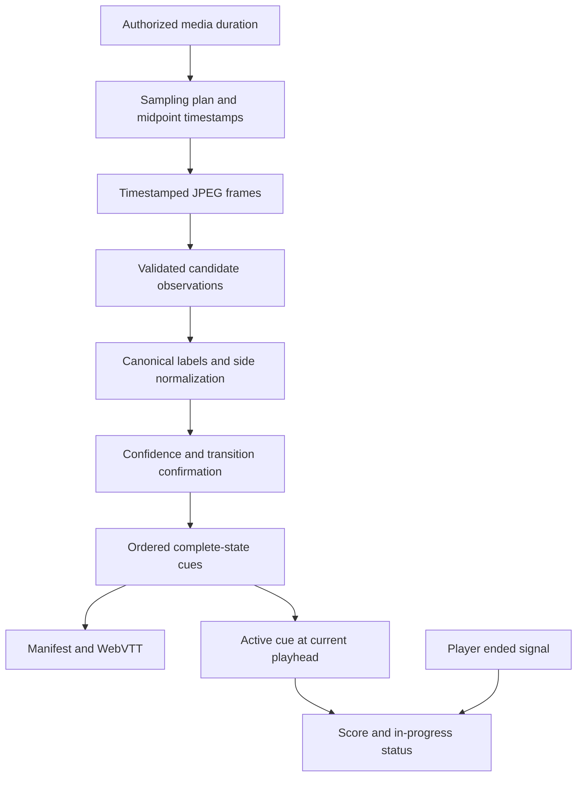

# Spoiler-safe score timeline contract

A Score Shield timeline is a sequence of **complete score states**, each bounded by media time. It is not an event feed and it is not a direct transcript of vision-model output. The model supplies candidate observations; deterministic reconciliation is the authority that decides whether a candidate may become a cue. The browser then resolves exactly one already-active state from the current playhead rather than presenting a schedule of changes.

<!-- openwiki: broken internal link [../workflows/score-timeline.md] file "../workflows/score-timeline.md" does not exist. Fix the href or restore the target, then delete this comment. -->
<!-- openwiki: broken internal link [../testing-and-source-map.md] file "../testing-and-source-map.md" does not exist. Fix the href or restore the target, then delete this comment. -->
This page defines the domain contract. [Runtime boundaries](../architecture/runtime-boundaries.md) covers job/SSE ownership and local processing, [the score-timeline workflow](../workflows/score-timeline.md) covers the end-to-end job, and [testing guidance](../testing-and-source-map.md) maps verification choices.

This flow shows that only reconciled cues, not model readings or future cue data, cross into score rendering.

## Data model and ownership

### Candidate observation

`analyzeFrame` asks the Responses API to inspect only the persistent live scoreboard graphic, not replay captions or statistics. Its JSON is parsed through `ObservationSchema` before it becomes an observation with an absolute `timestamp` and frame basename. The validated candidate shape is:

- `found`: whether a live scoreboard was found;
- `homeName` and `awayName`: nullable labels supplied by the model;
- `homeScore` and `awayScore`: nullable non-negative integers;
- `confidence`: a number in the inclusive range 0–1; and
- pipeline-added `timestamp` and `frame` evidence.

Validation establishes structural validity, **not truth**. Invalid JSON, a schema violation, a missing live scoreboard, missing scores, or low confidence cannot authorize a state. In particular, the prompt's requested left/right convention is helpful input but not a substitute for reconciliation-side normalization.

### Confirmed cue

A confirmed in-memory cue has `start`, `end`, `home`, `away`, `confidence`, and `evidenceFrame`. `home` and `away` each contain a stable `{ name, score }` object. It is deliberately a full state rather than a delta: a consumer that opens or seeks directly into an interval has all information required to render that interval without replaying earlier changes.

The output has two representations with different intended consumers:

| Representation | Contents and role |
| --- | --- |
| `manifest.json` | Schema version, job/source/sampling metadata, duration, creation time, and full cue objects including `evidenceFrame`. It is the durable per-job description of what was generated. |
| `score.vtt` | `WEBVTT` blocks numbered in cue order. Each block contains the time interval and JSON with complete `home`, `away`, and `confidence` state. It does not serialize `evidenceFrame`. |
| SSE completion snapshot | The processor supplies the in-memory cue array to the UI only on job completion. The current UI uses this array; it does not fetch the manifest or parse its VTT download. |

Treat the cue object and the VTT payload as a compatibility boundary. Adding an event-style field does not make it safe to render, and changing or omitting a complete-state field requires migrating every consumer deliberately.

## Producing reliable states

### Sampling assigns the time basis

The submitted interval must be a whole number from 5 through 30 seconds; missing input falls back to the configured default. For a known positive duration, the plan uses that interval until the closing 120 seconds and samples the closing window every 5 seconds. A short video entirely within that window uses 5-second sampling throughout. The selected interval and closing-window values are recorded in the manifest.

FFmpeg's FPS filter chooses a frame inside a sampling bucket, so `samplingFrameTimestamp` assigns the midpoint of that bucket, capped at duration. This absolute timestamp is the prospective cue boundary—not the frame filename and not a model-invented game clock. The denser closing window improves the opportunity to confirm late transitions; it does not relax any acceptance rule.

### Stable labels and normalized sides

Before accepting states, `reconcileObservations` derives one canonical label for each side from all found, non-empty candidate names. It chooses the most frequent name; ties favor scoreboard-like 2–5-character uppercase alphanumeric abbreviations, then shorter names and locale ordering. Every accepted cue uses those canonical labels, avoiding display churn when the model alternates a long name and an abbreviation.

Each candidate is then normalized to the canonical home/away order. Name matching compares uppercased alphanumeric forms and permits a prefix match only when the shorter normalized label has at least three characters. When both candidate labels match the opposite canonical sides, but not the expected sides, its scores are swapped. This makes side reversal a correction step before monotonicity is evaluated; otherwise a reversed read could look like an impossible regression or a false change.

### Acceptance state machine

Reconciliation processes the pipeline's chronological observations and owns all acceptance decisions:

1. Discard a candidate unless `found` is true, both scores are present, and confidence is at least `0.72`.
2. Accept the first qualifying normalized state as the initial state, with cue start fixed at `0`.
3. After that, discard an exact duplicate of the latest accepted score and discard any candidate whose score for either side is lower than the accepted state. Scores are therefore monotonic independently per side.
4. Hold a changed, non-regressing reading as a pending candidate. Accept it when a later reading has the same score pair; the candidate's timestamp begins the new cue.
5. If a later distinct reading dominates the pending candidate—neither side decreases and at least one increases—accept the pending candidate and retain the newer reading as the next pending candidate. This preserves rapid consecutive changes without accepting arbitrary regressions.
6. When accepting a state, close the previous cue at that state's start. After processing, set the last cue end to media duration. If nothing qualifies, fail rather than fabricate a timeline.

Thus the timeline must be ordered, non-overlapping, duration-bounded, and contiguous from the initial state through the final cue. Repeated-change confirmation is protection against one-frame OCR/model errors and replay artifacts, not proof of sport-specific officiating. The mechanism may miss a state that sampling never observes, so extensions must not claim event completeness merely because the output is monotonic.

## Serialization and playback invariants

`cuesToVtt` formats each cue's numeric endpoints as `HH:MM:SS.mmm` and writes the complete JSON state into a numbered VTT block. Reconciliation establishes the ordering and non-overlap required for reliable cue serialization; VTT export does not independently repair malformed cue input. Preserve these boundaries when introducing another serializer or a new source of cues.

The player uses a binary search for the latest cue whose `start` is less than or equal to the reported media time. It renders only that cue's score, labels, confidence, and interval. This supplies the required seek behavior:

- a backward seek resolves the earlier state again;
- a forward seek resolves the destination state immediately; and
- the player does not need to reveal or list later cues to perform either operation.

The score title and accessible visible status are playhead-derived. They must remain `in progress` until the embedded player reports playback completion. Merely arriving at the final cue, or seeking within it, is **not** authorization to expose a final state. An ended signal marks the state `final`; a later time update that moves back before the final cue clears that flag. This extra completion gate prevents a viewer who has skipped ahead from being told that the currently displayed cue is the result of the entire match.

The player accepts time and ended messages only from its embedded YouTube frame at the expected YouTube origin. It must also keep source titles, candidate readings, future cue contents, event/scorer metadata, and final-status wording out of visible UI, document titles, accessibility labels, and operational progress/log messages before their permitted time.

## Failure behavior and safe extension

There is no partial or best-effort score timeline. Failed media tools, no extracted frames, missing analysis key, malformed model output, schema rejection, or no reliable accepted state reject processing; the processor reports a failed job instead of emitting cues. `observations.json` is useful per-job evidence but remains candidate data and is never a browser authority.

When changing this contract:

1. Keep sampling cadence and midpoint timestamps aligned with frame extraction, then retain the corresponding manifest fields.
2. Update Zod validation and fixtures together if the model response or observation shape changes. Put trust rules in deterministic reconciliation rather than in the prompt.
3. Preserve canonical labels, side normalization before score comparison, independent score monotonicity, repeated-change confirmation, and previous-cue closure. If a rule must change, add a counterexample first.
4. Keep VTT intervals ordered/non-overlapping and payloads complete. Migrate the manifest, SSE, and UI consumers together for any cue-shape change.
5. Preserve active-cue seek resolution and completion-only final status. Do not add a future-event list as a convenience UI.

`tests/pipeline.test.mjs` exercises interval bounds and closing-window cadence, midpoint timestamps, null-scoreboard parsing, regression rejection, stable labels, fast consecutive transitions, terminal-window confirmation, and VTT state serialization. Run `npm run test:unit` and `npm run lint` for pipeline/configuration changes. UI changes to player title, status, or cue resolution additionally require `npm test`; the existing suite does not simulate iframe interaction, so add focused coverage if changing that integration.
