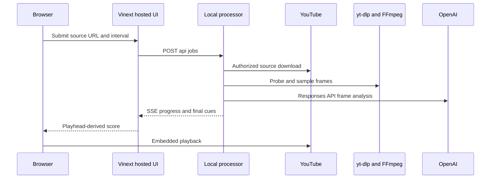
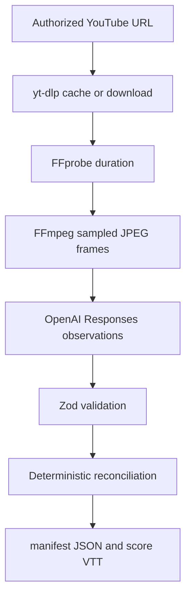

# Media, AI, and hosted UI integration boundaries

Score Shield is deliberately split between a **local processor**, which handles authorized media and holds the OpenAI credential, and a **Cloudflare/Vinext web experience**, which can be hosted independently and includes a simulated demo. The Worker neither runs nor proxies the local media pipeline. This separation is fundamental: native executables, downloaded source media, job state, and `OPENAI_API_KEY` remain on the operator machine, while the hosted UI renders the product experience.

<!-- openwiki: broken internal link [../workflows/score-timeline.md] file "../workflows/score-timeline.md" does not exist. Fix the href or restore the target, then delete this comment. -->
For the end-to-end job lifecycle, see [Score timeline generation and spoiler-safe playback](../workflows/score-timeline.md); for startup and boundary operations, see [Score Shield quickstart](../quickstart.md) and [Hosted UI and local processor architecture](../architecture/runtime-boundaries.md).

This is the real-processing path: the browser calls the configured processor URL directly, while the embedded player separately calls YouTube.

## YouTube: source acquisition and playback are separate contracts

The processor accepts only HTTPS `youtube.com`, `www.youtube.com`, and `youtu.be` URLs. It invokes `yt-dlp` with a no-playlist policy, chooses best video plus audio (falling back to a combined format), and requests MP4 merging. Use this only for media the operator is authorized to download and analyze; the application is not a means to bypass access controls.

Downloaded source media is cached beneath `artifacts/cache/youtube/<hash>/source.*`. The key is based on the normalized YouTube video ID when one can be extracted, so equivalent watch and short URLs share a cache entry. A process-local promise also makes concurrent requests for the same key wait for one download. This only shares source acquisition: every job independently samples frames, calls the model, reconciles observations, and writes its own artifacts. Partial downloader files and zero-size sources are not cache hits.

The UI plays a YouTube embed, not the cached MP4. It enables the JavaScript API and accepts `postMessage` events only from `https://www.youtube.com` and the particular iframe; current time drives cue selection and a playback-ended event permits the `final` label. The initial overlay is a useful pre-playback shield, but it is not control of the provider player. **YouTube owns its iframe chrome:** after the cover is removed and playback begins, provider titles, thumbnails, controls, hover, pause, or loading UI can still disclose source information, including a final score. Neither the cover nor surrounding React UI can suppress that provider-owned surface. First-party serving and playback of an authorized local MP4 would be a separate future architecture with media-serving and range-seeking work.

## Local media and OpenAI analysis

`npm run processor` loads `.env` and starts the Node HTTP processor. Startup rejects a missing or whitespace-only `OPENAI_API_KEY` before it opens the listener; the server is loopback-only at `127.0.0.1` and defaults to port `8787`. The key must stay out of browser code and source control. `YTDLP_PATH`, `FFMPEG_PATH`, and `FFPROBE_PATH` can override commands found on `PATH`; `OPENAI_MODEL` defaults to `gpt-5.6`.

After download or cache reuse, FFprobe supplies the media duration. A nonpositive or nonnumeric duration fails the job. FFmpeg then creates JPEG frames scaled to no more than 1280 pixels wide. The interval is an integer from 5 through 30 seconds (default 10); the final 120 seconds use five-second sampling when that is more frequent. Frame timestamps represent the centers of their sampling buckets, so they are an approximation of the observed broadcast state rather than a claim of exact event time.

For each frame, the processor base64-encodes the JPEG and calls the OpenAI **Responses API** through `client.responses.create`. The prompt instructs the vision model to report only the persistent live scoreboard, not replay captions or statistics. Its compact JSON is validated with Zod before being retained as an observation. Model output is therefore candidate evidence, not the published timeline.

The local transformation contract: media tools produce timestamped images, the model proposes scoreboard readings, and deterministic code decides which score states may reach the manifest and VTT.

### Reconciliation invariants and failures

Reconciliation selects stable canonical team labels, normalizes an observation when its team sides appear reversed, and ignores observations without a legible scoreboard, scores, or confidence of at least `0.72`. It never accepts equal or regressive scores. A changed score is initially a candidate and normally needs a matching subsequent observation before acceptance; when a later observation dominates a pending candidate, the candidate is accepted and the newer reading becomes the next candidate. Accepted states form contiguous cues: the next cue start closes the previous cue, and the final cue ends at the probed duration. No accepted state is an error, rather than a fabricated timeline.

The processor writes raw validated observations to `observations.json`, then writes `manifest.json` and `score.vtt`. VTT cues contain a JSON payload for home/away score and confidence. These files are local artifacts; the player receives final cues through SSE and offers the VTT as a download rather than parsing the manifest or VTT for its live display.

Failures in `yt-dlp`, FFprobe, FFmpeg, malformed model output, OpenAI access, or reconciliation reject the pipeline and are surfaced as the job's failed progress state. There is no durable queue, retry policy, or cancellation propagation. In particular, the UI Cancel action closes its event stream and resets the screen but does not stop already-running local work.

## Hosted UI: Cloudflare Worker and Vinext

The Worker is the hosted request entrypoint. It routes `/_vinext/image` to Vinext image optimization, drawing static inputs through the `ASSETS` binding and applying Cloudflare image transforms via `IMAGES`; all other requests go to Vinext's app-router handler. This is application delivery and image handling, not a media-processing service. The public preview uses fixed demo cues and a timer, so it makes no processor request, download, or OpenAI call.

Vite combines Vinext, the Cloudflare Vite plugin, and a build plugin that recreates `dist/.openai` after compilation and copies `.openai/hosting.json` plus `drizzle/` when present. `npm run build` builds this hosted application; `npm run processor` starts the distinct local process. Do not move pipeline assumptions—filesystem artifact paths, media binaries, or the OpenAI key—into `worker/index.ts` merely because both are developed from the same repository.

### D1 and Drizzle are scaffolding, not persistence

The Worker environment type and `getDb()` helper anticipate a `DB` D1 binding, and `getDb()` deliberately throws if it is absent. But `.openai/hosting.json` sets both `d1` and `r2` to `null`; Vite consequently declares neither binding. `db/schema.ts` exports no tables, and the Drizzle configuration merely identifies a future SQLite schema and migration output. Thus there are **no product tables, no configured D1 binding, and no persisted processor job state**. Adding tables requires an intentional schema, migration, hosting binding, and application ownership design; packaging the empty migration directory is not activation.

## OpenWiki automation boundary

Repository documentation is generated locally with `openwiki code --init` or refreshed with `openwiki code --update --print`. The scheduled GitHub Actions workflow also supports manual dispatch and runs daily at 08:00 UTC. It installs OpenWiki on Node 22, runs update mode, and opens or updates a `docs: update OpenWiki` pull request limited to `openwiki` and `AGENTS.md`, rather than committing the generated update directly to the default branch.

The workflow is fixed to `OPENWIKI_PROVIDER: openai` and `OPENWIKI_MODEL_ID: gpt-5.6-terra`. Its **only provider credential is `OPENAI_API_KEY`**. The separate `AUTOMATION_TOKEN` is used solely by the pull-request action, not to select or authenticate an AI provider. Do not replace this arrangement with OpenRouter, LangSmith, or another provider secret without changing the repository's explicit automation contract.

## Safe changes and focused validation

- **Media acquisition or sampling:** preserve the authorized-use constraint, YouTube URL validation, cache identity behavior, executable overrides, interval range, closing window, and center-of-bucket timestamps. Run `npm run test:unit`; `tests/pipeline.test.mjs` covers these helpers, cache equivalence, reconciliation cases, and VTT formatting.
- **Prompt or reconciliation changes:** treat model output as untrusted candidate data. Keep schema validation and deterministic acceptance rules, then extend pipeline tests with regressions, repeated observations, reversed sides, and closing-window score changes.
- **YouTube/player changes:** preserve origin-and-source checks and playhead-based title derivation. Never claim an iframe cover eliminates provider chrome after playback starts. Run `npm test` for player or hosted rendering changes, because it builds and verifies rendered routes.
- **Worker or deployment changes:** review `worker/index.ts`, `vite.config.ts`, `build/sites-vite-plugin.ts`, and `.openai/hosting.json` together. Keep the Worker independent of the processor unless a new, secured remote-processing design is implemented and tested.
- **D1 adoption:** add real tables and migrations, configure the binding, and decide durable job/artifact ownership before calling it persistence. Test unavailable-binding behavior and the new data lifecycle.
- **Automation changes:** retain OpenAI plus `gpt-5.6-terra` and the sole provider key `OPENAI_API_KEY`; validate workflow behavior and PR permissions separately from local application tests.
