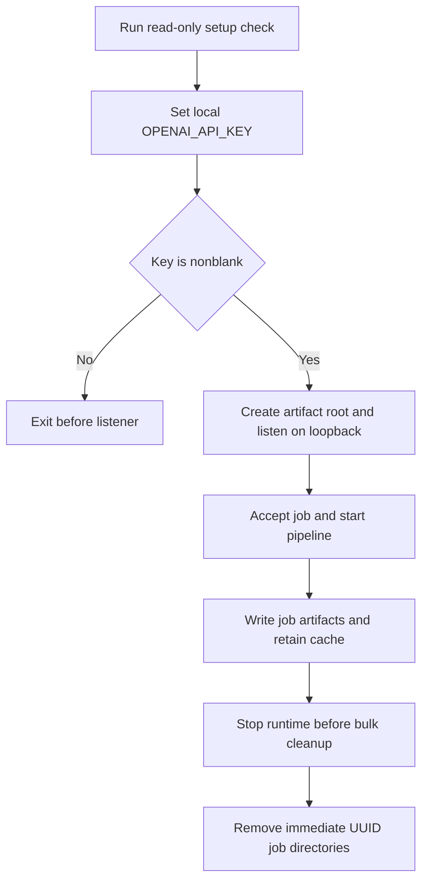

# Local processor operations and artifact runbook

The local Node processor performs the work that the hosted UI cannot: it uses native media tools, writable local storage, and the OpenAI credential to produce score-timeline artifacts. It is deliberately a loopback-only prototype, not a public service. The browser uses `NEXT_PUBLIC_PROCESSOR_URL` to contact it directly; the hosted UI and `/preview` demonstration do not host or proxy this runtime. For the API/SSE contract and runtime boundary, see [Hosted UI and local processor architecture](../architecture/runtime-boundaries.md); for the media and model integration, see [Media, AI, and hosted UI integration boundaries](../integrations/media-ai-and-hosted-ui.md).

## Safety rules

- Process only media you are authorized to download and analyze.
- Keep `OPENAI_API_KEY` server-side in `.env` or an equivalent local process environment. Never place it in browser configuration, logs, fixtures, committed files, or documentation examples containing a real value. `.env*` and `artifacts/` are Git-ignored, with `.env.example` retained as the non-secret template.
- A blank or missing `OPENAI_API_KEY` **must fail before the processor listens**. Do not bypass this gate to make a health endpoint appear available.
- Keep the listener on its implemented `127.0.0.1` bind. Changing a browser URL, CORS setting, or host does not add authentication, durable job ownership, quotas, cancellation, or recovery.
- Stop processing before bulk cleanup. Cleanup is intentionally narrow: it may remove only UUID-named, immediate child job directories of the selected artifact root. It must preserve `cache/` and every unrelated path.

## Read-only prerequisite checks versus installation

Node.js `22.13.0` or later is required. `ffmpeg`, `ffprobe`, and `yt-dlp` must be discoverable on `PATH` unless their executable overrides are configured. To inspect readiness, use the read-only check—not installation-capable setup:

```bash
node --version
npm --version
npm run setup:check
```

`npm run setup:check` validates Node and reports missing media commands without running `npm install`, copying `.env`, or installing system packages. It exits with an error if a required command is missing.

Use the dry run when an operator wants to review what installation-capable setup *would* execute:

```bash
node scripts/setup.mjs --dry-run
```

Dry run prints the `npm install`, package-manager, and possible `.env` creation actions but does not execute them. Do not run `npm run setup` merely to inspect the repository: it can modify the project and, when media tools are absent, invoke Homebrew, apt, dnf, pacman, Winget, or Chocolatey (and may require `sudo`).

After reviewing the plan, prepare a development machine with:

```bash
npm run setup
```

This mode runs `npm install --no-audit --no-fund`, installs missing media tools through the first supported manager for the platform, creates `.env` from `.env.example` only when it does not already exist, and then verifies the tools are on `PATH`. On Windows, restart the terminal if newly installed commands are not found, then run `npm run setup:check`. If no supported manager is available, install the tools through the organization-approved method and rerun the check.

## Configure the local process

Create `.env` through the installation procedure or copy the template yourself, then set the key locally:

```dotenv
OPENAI_API_KEY=your_key_here
```

Do not commit the completed file. The template defines these usual local settings:

| Variable | Default | Operational effect |
| --- | --- | --- |
| `OPENAI_API_KEY` | none | Required nonblank server-side credential for processor startup and OpenAI frame analysis. |
| `OPENAI_MODEL` | `gpt-5.6` | Model passed to the Responses API for scoreboard-frame analysis. |
| `FRAME_INTERVAL_SECONDS` | `10` | Default whole-second sampling interval for API calls that omit one; valid range is 5–30. |
| `PROCESSOR_PORT` | `8787` | Loopback processor port. |
| `NEXT_PUBLIC_PROCESSOR_URL` | `http://localhost:8787` | Browser-visible URL used by the React UI to reach the separate local processor; this is not a place for secrets. |
| `YTDLP_PATH`, `FFMPEG_PATH`, `FFPROBE_PATH` | command name on `PATH` | Optional absolute executable overrides for local tool discovery/execution. |
| `ARTIFACTS_DIR` | `artifacts` | Optional artifact root used by the processor and cleanup command. |
| `WEB_ORIGIN` | `http://localhost:3000` | Single origin returned in processor CORS headers. |

A submitted job can override `FRAME_INTERVAL_SECONDS` with a valid `frameIntervalSeconds`; the final 120 seconds are sampled at five seconds when that is more frequent. Lower intervals mean more frames and model calls. The processor validates the API key before creating the artifact root or opening the HTTP listener, so a key error is a startup configuration failure, not a job failure.

## Start, verify, and stop

For normal local development, start both runtimes:

```bash
npm run dev
```

This launches `server/index.mjs` with `.env` if it exists and runs `npm run dev:web`. With a valid configuration, the processor logs a listening URL at `http://localhost:8787` by default, while the web UI normally serves `http://localhost:3000`.

For focused operation, run either runtime separately:

```bash
npm run processor
npm run dev:web
```

Verify the processor only after its startup log reports listening:

```bash
curl http://localhost:8787/health
```

A successful response is `{ "ok": true }`. The processor binds `127.0.0.1`, and CORS allows `WEB_ORIGIN` or `http://localhost:3000`; a remote health check is not a supported deployment test.

Press `Ctrl+C` in the `npm run dev` terminal to stop both child processes. Its supervisor forwards `SIGINT` and exits with code 130; on `SIGTERM` it sends termination to both and exits 143. If either child exits with a nonzero status other than 130, the supervisor stops the other child and returns that status. When running `npm run processor` and `npm run dev:web` independently, stop each terminal/process separately.



This flow shows the key gate and the intended order for processing and cleanup.

## Operating expectations and diagnosis

A `POST /api/jobs` returns `202` and processing continues asynchronously. The in-memory job registry publishes an initial and subsequent snapshot through `GET /api/jobs/:id/events`; progress normally moves through `downloading`, `extracting`, `analyzing`, `reconciling`, `exporting`, and `complete`. A pipeline rejection changes the job stage to `failed` with its error message. Job records, status access, and open SSE streams disappear on processor restart even if partial or completed files remain on disk. There is no durable queue, retry mechanism, cancellation endpoint, concurrency control, or restart recovery. The UI’s Cancel control merely closes its EventSource and resets the browser; it does not stop local work.

Use the processor terminal’s structured JSON logs to determine the failure stage. Logs include job IDs, tool start/completion/failure, bounded progress, cache events, durations, and frame counts. Preserve the existing restraint: do not add keys, model responses, detected scores, or source-video titles to logs, status messages, fixtures, or browser output.

| Symptom | Check and safe response |
| --- | --- |
| Process exits before listening with `OPENAI_API_KEY is missing` | Set a nonblank local key in `.env`, ensure the process is launched through `npm run processor` or `npm run dev` so the env file is loaded, then restart. Do not put the key in `NEXT_PUBLIC_PROCESSOR_URL` or client code. |
| Setup check reports Node too old | Install Node.js `22.13.0` or newer, open a new shell, and rerun `node --version` and `npm run setup:check`. |
| Setup reports missing media commands | Use `node scripts/setup.mjs --dry-run` to review the proposed install, then authorize `npm run setup` or install organization-approved binaries. On Windows, restart the shell before rechecking PATH. |
| Browser cannot reach the processor | Confirm the processor startup log and `curl` health check, then ensure `NEXT_PUBLIC_PROCESSOR_URL` targets its actual local port and `WEB_ORIGIN` matches the UI origin. Keep the service loopback-only. |
| Job fails during download | Confirm the source is an authorized HTTPS `youtube.com`, `www.youtube.com`, or `youtu.be` URL and that `yt-dlp` or `YTDLP_PATH` works from the processor environment. A cache miss downloads once; same-video jobs can wait on the same in-process download. |
| Job fails during extraction | Confirm `ffprobe` and `ffmpeg` or their overrides are executable. Failures include unavailable tools, an unreadable source, invalid/nonpositive probed duration, or no produced frames. |
| Job fails during analysis or reconciliation | Confirm the credential and model access, then inspect only safe operational metadata and the job’s local artifacts. Malformed model output, API errors, or no reliable score state fail rather than fabricate a timeline. |
| Status or artifact URL becomes `404` after restart | This is expected because authorization is the process-local job map. Restarting does not re-register files; submit a new job rather than treating retained files as a recovered job. |

## Artifact layout, retention, and cleanup

For each UUID job, the pipeline writes under `ARTIFACTS_DIR` (or `artifacts`):

```text
artifacts/
  <job-id>/
    frames/
    observations.json
    manifest.json
    score.vtt
  cache/youtube/<cache-key>/source.*
```

Job directories contain sampled JPEGs, validated model observations, and the generated manifest/VTT. The source cache is deliberately separate. Its cache key normalizes a recognized YouTube video identity, so equivalent supported URLs can reuse the same downloaded source; each job still creates its own frames and outputs. In-progress same-source downloads are shared only within the running processor.

The processor has **no automatic cache eviction**, size limit, or expiration policy. Treat cached media as potentially large and sensitive local data. Retain it only as long as authorized and needed. To reclaim cached source media, manually remove the appropriate `cache/youtube/` content after stopping the processor and verifying the selected `ARTIFACTS_DIR`; the job cleanup command intentionally will not do this.

To remove generated job outputs while preserving all cached media and unrelated paths, stop the processor, verify the artifact-root setting, then run:

```bash
npm run artifacts:clean
```

The command resolves `ARTIFACTS_DIR` or `artifacts`, lists only immediate entries, and recursively deletes entries that are directories whose names match UUID versions 1–5. A missing root succeeds with no removals. It does not recurse to discover UUID directories elsewhere, and it leaves `cache/` plus non-UUID directories intact. This is a safety boundary, not a general-purpose deletion or cache-eviction tool.

## Safe maintenance and validation

Before changing setup/install behavior, preserve the distinction between `--check`, `--dry-run`, and installation-capable setup; extend `tests/setup.test.mjs` for package-manager plans. Before changing cleanup, preserve the immediate UUID-directory rule and cache preservation; extend `tests/clean-artifacts.test.mjs`. Before changing key gating, retain fail-before-listening behavior and update `tests/server-startup.test.mjs`.

Run focused checks for these operational changes:

```bash
npm run test:unit
npm run lint
```

<!-- openwiki: broken internal link [../workflows/score-timeline.md] file "../workflows/score-timeline.md" does not exist. Fix the href or restore the target, then delete this comment. -->
Run `npm test` when the change also affects the hosted UI, build output, or browser-facing contract. For a fuller pipeline and job lifecycle explanation, see [Score timeline generation and spoiler-safe playback](../workflows/score-timeline.md); for general project onboarding, see [Score Shield quickstart](../quickstart.md).
