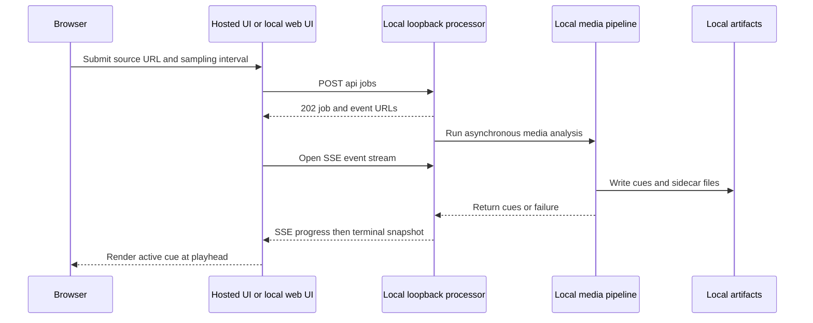

# Score Shield quickstart

Score Shield is a spoiler-free sports playback reference implementation. Its local processor turns an **authorized** YouTube source into reconciled score cues and a WebVTT sidecar; the React player selects the one complete score state active at the viewer's playhead. The timeline metadata—not a modification of the source video—is the product's spoiler-control layer.

## First orient yourself: two runtimes, one browser contract

The deployed Cloudflare/Vinext site is a UI and simulated demo. Real processing is a separate local Node process because it needs an authorized source download, `yt-dlp`, FFmpeg/FFprobe, writable artifacts, and a server-side `OPENAI_API_KEY`. The hosted Worker neither runs nor proxies that pipeline. Treat `NEXT_PUBLIC_PROCESSOR_URL` as the browser's endpoint for a separately operated processor, never as a way to deploy it.



This is the real-job control path: UI progress arrives over SSE, but the score display is derived locally from the embedded player's current time. The `/preview` experience is deliberately processor-independent: it uses a timer and fixed demo cues, with no download or model request. The local server validates its environment before listening, binds to `127.0.0.1`, and stores jobs only in process memory. Do not expose it by changing CORS, a host, or a browser URL; authentication, durable ownership, recovery, cancellation, quotas, and remote-operation controls do not exist.

For the complete boundary, API, SSE, artifact, and Worker details, see [Hosted UI and local processor architecture](architecture/runtime-boundaries.md). For the end-to-end transformation, see [Video job processing workflow](workflows/process-a-video-job.md).

## Spoiler-safety rules: preserve these before changing anything

1. **Render the score from current media time.** The player finds the latest cue that starts at or before the reported playhead. Backward seeks must restore the earlier state; forward seeks must resolve the destination state without listing future cues.
2. **A score cue is a complete state, never just an event delta.** It carries both team names and scores for its bounded interval, so a direct seek has no need to reconstruct or disclose later history.
3. **`final` needs a real playback-ended signal.** Being inside the last cue—or seeking there—is not enough. A subsequent seek back before that cue clears final status.
4. **Model output is untrusted candidate evidence.** Zod checks its shape, while deterministic reconciliation controls canonical team sides, confidence, monotonic scores, repeated-change confirmation, cue boundaries, and failure when no reliable state exists.
5. **Keep every result-bearing surface safe.** Do not introduce future scores, scorers, events, final-result wording, source titles, candidate observations, or future-cue contents into visible text, document titles, accessibility text, progress, fixtures, or logs. The initial YouTube cover reduces initial exposure but cannot control provider-owned chrome once uncovered.

The detailed acceptance and playback contract is in [Spoiler-safe score timeline contract](concepts/spoiler-safe-score-timeline.md). Changes to this contract require deterministic fixtures and tests; prompt wording alone is not a safety mechanism.

## Prepare without unexpectedly modifying the machine

Node.js `22.13.0` or newer is required. Do **not** run installation-capable setup merely to inspect the repository: it can install npm dependencies and missing native media tools, may use a system package manager and `sudo`, and creates `.env` only if it is absent. Start with read-only inspection instead:

```bash
node --version
npm --version
npm run setup:check
node scripts/setup.mjs --dry-run
```

`npm run setup:check` verifies readiness without installing packages, tools, or `.env`; `--dry-run` shows what setup would do without executing it. After reviewing that plan, use the mutating setup only when authorized:

```bash
npm run setup
# Set a nonblank OPENAI_API_KEY in the local .env file
npm run dev
```

`.env.example` is the committed, non-secret configuration contract. Keep `OPENAI_API_KEY` server-side: never commit `.env`, put the key in `NEXT_PUBLIC_*`, React state, fixtures, or logs. The processor exits before opening its listener if the key is missing or blank, so a health check cannot stand in for configuration. By default the UI is at `http://localhost:3000` and the processor health endpoint is `http://localhost:8787/health`; the demo remains usable without either a processor or a key.

The local processor's normal inputs and outputs may be sensitive: source media is cached under `artifacts/cache/youtube/`, while each job writes frames, observations, a manifest, and VTT under its own artifact directory. Process only media you are authorized to download and analyze. For configuration, startup, diagnostics, shutdown, retention, and cache-preserving cleanup, follow [Local processor operations and artifact runbook](operations/local-processor-runbook.md).

## Route the task before editing

| If the task concerns… | Start here | Follow through to | Minimum validation direction |
| --- | --- | --- | --- |
| Runtime ownership, browser-to-processor API/SSE, jobs, artifacts, CORS, Worker build, or deployment | [Hosted UI and local processor architecture](architecture/runtime-boundaries.md) | `app/page.tsx`, `server/index.mjs`, Worker/build files as applicable | Add HTTP/SSE coverage before expanding transport behavior; run lint and `npm test` for a browser/shared contract. |
| Score states, sampling cadence/timestamps, reconciliation, manifests, WebVTT, playhead lookup, or final status | [Spoiler-safe score timeline contract](concepts/spoiler-safe-score-timeline.md) | [Video job processing workflow](workflows/process-a-video-job.md) | Extend `tests/pipeline.test.mjs`; run `npm run test:unit` and `npm run lint`, plus `npm test` for player-facing changes. |
| A submitted video from validation through download, AI, progress, failure, or exports | [Video job processing workflow](workflows/process-a-video-job.md) | Timeline contract and runtime boundaries | Preserve server validation and terminal failure semantics; test the boundary being changed. |
| Local prerequisites, secrets, ports, processes, tool failures, cleanup, or retained media | [Local processor operations and artifact runbook](operations/local-processor-runbook.md) | Runtime boundaries | Keep check/dry-run/setup distinct; use the focused setup, startup, or cleanup test and lint. |
| YouTube, `yt-dlp`, FFmpeg/FFprobe, OpenAI Responses, iframe limitations, Cloudflare/Vinext, D1, or OpenWiki automation | [Media, AI, and hosted UI integration boundaries](integrations/media-ai-and-hosted-ui.md) | Workflow or architecture as needed | Do not make live network/model calls the default test; add deterministic seams and focused coverage. |
| Selecting regression coverage or locating a source owner | [Change-oriented testing and source map](testing/change-validation.md) | The owning domain page | Use the narrow owner test, always lint source changes, and include build/render validation when a delivered consumer can change. |

`npm run test:unit` runs pipeline, startup, cleanup, and setup suites. `npm test` additionally builds the hosted application and exercises rendered Worker HTML; it is the appropriate handoff check for UI, Worker, metadata, route, deployment, or shared browser-contract changes. Run `npm run lint` with every source change.

## Safe extension boundaries

- **Do not turn the local prototype into a public API by configuration.** A real remote processor needs an explicit design for authentication, authorization, durable jobs/artifacts, cancellation propagation, retry/reconnect behavior, concurrency/quotas, retention, and security tests.
- **Do not make browser display authoritative over reconciliation.** If the cue shape, model schema, or acceptance rule changes, coordinate validation, deterministic processing, artifact serialization, SSE, and the UI consumer.
- **Do not claim the YouTube iframe is fully controlled.** The app does not fetch or render the source title, and it filters iframe messages by expected origin and frame, but YouTube-owned UI may still reveal information after the cover is removed.
- **Do not treat generated documentation as proof.** Source and focused tests are authoritative. Use this page to find the owning contract, then inspect the implementation and tests before changing behavior.
