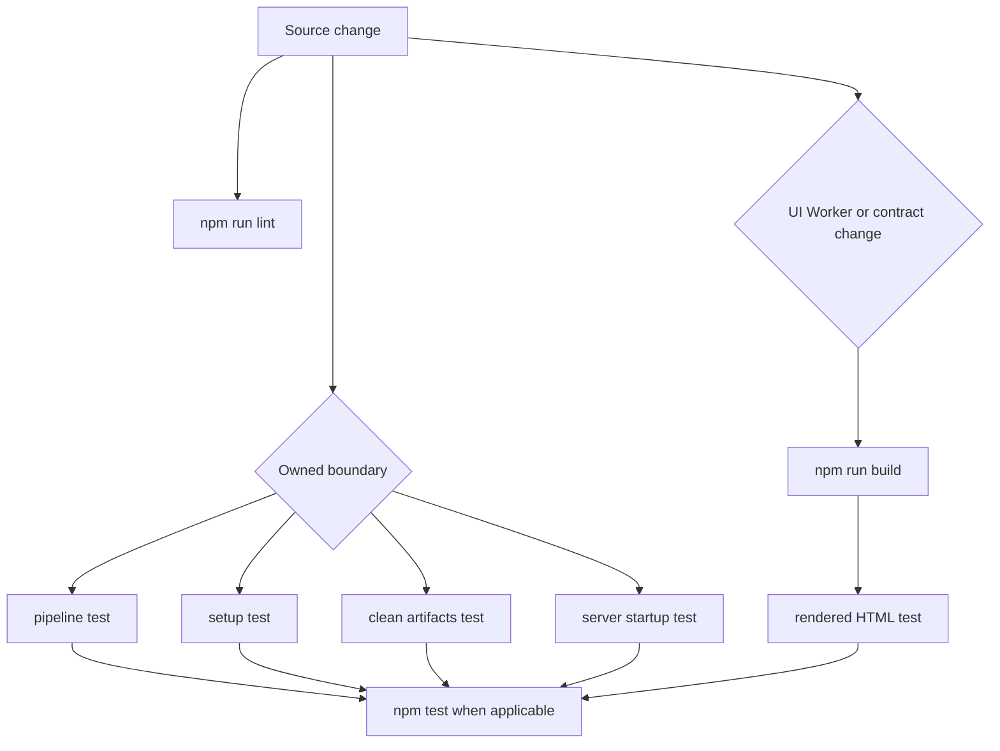

# Change-oriented testing and source map

Score Shield has a deliberately small, layered test suite. `npm test` first runs the focused Node tests, then builds the Vinext/Cloudflare Worker application, then imports the generated Worker and asserts rendered HTML. `npm run lint` is separate and must accompany every source change. This page maps a change to the smallest existing check that establishes its contract, and identifies the boundaries for which a new focused test is required.

*The validation route: always lint the edited source; use the narrow owner test, and include the build plus generated-Worker rendering path whenever a shared consumer contract or delivered UI can change.*

## Baseline commands and ownership

| Change owner / observable contract | Focused current check | Required command selection |
| --- | --- | --- |
| Sampling limits and plan, frame timestamps, source cache keys, observation parsing, reconciliation, and VTT serialization in `server/config.mjs` and `server/pipeline.mjs` | `tests/pipeline.test.mjs` | Run `node --test tests/pipeline.test.mjs` and `npm run lint`. Run `npm test` when output, progress, or an exposed artifact/API contract changes. |
| Processor preflight in `server/startup.mjs` and its process entry in `server/index.mjs` | `tests/server-startup.test.mjs` | Run `node --test tests/server-startup.test.mjs` and `npm run lint`. Add an HTTP-level test before relying on altered route behavior. |
| Artifact deletion policy in `scripts/clean-artifacts.mjs` | `tests/clean-artifacts.test.mjs` | Run `node --test tests/clean-artifacts.test.mjs` and `npm run lint`. |
| Platform package-manager planning in `scripts/setup.mjs` | `tests/setup.test.mjs` | Run `node --test tests/setup.test.mjs` and `npm run lint`. Add process-level coverage if changing actual installation, PATH checking, `.env` creation, or failure handling. |
| Product shell, `/preview`, route delivery, metadata visible in initial HTML, or build/Worker configuration | `tests/rendered-html.test.mjs` after `npm run build` | Run `npm run build`, then `node --test tests/rendered-html.test.mjs`, plus `npm run lint`; normally use `npm test`. |

The package scripts define `npm run test:unit` as the four focused Node suites and `npm test` as those suites plus the build and rendered-Worker test. The rendered test imports `dist/server/index.js` and invokes its `fetch` handler for `/` and `/preview`; it is therefore the relevant consumer-path regression check, not merely a static source assertion.

**Build/render rule.** Use the build plus rendered-Worker path for changes to UI, Worker behavior, deployment/build configuration, page metadata, routes, or any shared consumer contract—including a processor payload shape that the client consumes. A processor-only internal helper change may stay with its narrow pipeline test if neither artifact nor consumer-facing behavior changes. Pair every source change with `npm run lint`.

## Timeline and processor regressions

The pipeline is the system of record for a processed timeline: it derives a sampling plan, obtains timestamped frames, asks the OpenAI Responses API for observations, reconciles them into contiguous score cues, and writes both `score.vtt` and `manifest.json`. The server starts this work after accepting a job and broadcasts each updated progress object and, on completion, its cues. The browser chooses the latest cue whose `start` is no later than the player time, so cue starts and ends are a shared pipeline-to-UI contract.

`tests/pipeline.test.mjs` already protects the principal pure invariants: intervals are integral 5–30 seconds; the final 120 seconds use five-second sampling; timestamps are at sampling-bucket centers; equivalent YouTube URLs share a cache identity; low-confidence, missing, repeated, and regressing observations do not create false states; a score change needs confirmation; labels are normalized; the final cue reaches the media duration; and VTT timestamps/payloads are emitted.

### Mandatory timeline regression matrix

When modifying reconciliation, sampling, observations, VTT/manifest construction, player cue lookup, or their shared data shape, extend `tests/pipeline.test.mjs` (and use the Worker render path when the UI consumes the changed shape). Do not accept a visual-only verification.

| Modified behavior | Focused regression that must be present or added |
| --- | --- |
| Cue boundary or timestamp logic | Assert exact adjacent `[start, end]` boundaries, including first cue at zero, the change timestamp, and final cue end equal to duration. Cover the final high-frequency window if its calculation or frame timestamps change. |
| Score acceptance/reconciliation | Assert duplicate observations and score regressions are rejected, a changed score requires its confirmation rule, and rapid consecutive legitimate changes remain ordered. |
| Model schema, prompt parsing, or malformed output handling | Add cases for invalid JSON, schema-invalid values, null/missing score fields, and unexpected API response shapes; assert the intended fail-or-skip behavior and that no misleading cue is emitted. Current tests only exercise `parseObservation` with a valid no-scoreboard object. |
| URL validation or URL identity | Add server HTTP tests for unsupported, malformed, non-HTTPS, and alternate accepted YouTube URLs, and separately retain cache-key equivalence tests when cache identity changes. |
| Progress stages, weights, messages, or terminal behavior | Test the emitted sequence/shape at the processor boundary and the client state transition: stages must remain understandable, terminal `complete` supplies cues, and `failed` does not enter the player. |

The implementation rejects observations that are not found, are below 0.72 confidence, or lack either score; it rejects non-increasing scores after an accepted state; it requires a repeated candidate before accepting a normal change; and it uses a dominance case to retain fast consecutive changes. Those rules are spoiler-safety logic, not incidental implementation detail: alter them only with fixture-based regressions that show the exact resulting cues.

## UI and delivered behavior

`app/page.tsx` owns the interactive client state: landing, processing, and player; it posts a requested URL and interval to `/api/jobs`, opens an `EventSource` to the returned job’s events endpoint, and enters the player only on a `complete` event. It also maps the embedded YouTube player’s authenticated `postMessage` time updates to the current cue and document title. `/preview` reuses the application with its timed local demo. These are behaviorally connected to processor stage/cue payloads even though their current automated evidence is only server-rendered HTML.

For UI changes, retain or add focused coverage according to the changed promise:

- For initial copy, links, route availability, title/metadata, shell structure, or `/preview` SSR output, extend `tests/rendered-html.test.mjs` with a targeted assertion and run the build/Worker path.
- For `cueAt`, final-status reset on seeking, title generation, request body construction, EventSource parsing, cancellation/reset cleanup, or demo timing, extract the narrow pure behavior if needed and add unit tests. A rendered HTML assertion cannot establish client-state behavior.
- For the YouTube iframe boundary, add browser-level interaction coverage before changing `postMessage` origin/source filtering, playhead handling, cover behavior, or end-of-playback semantics. The current rendered test never runs iframe interaction.
- For control semantics, form errors, focus, keyboard use, ARIA, contrast, or screen-reader behavior, add focused accessibility testing before expanding the accessibility contract; there is currently no accessibility coverage.

## HTTP, SSE, and external integration gaps

The current suite does **not** cover HTTP validation or SSE recovery. It does not start the server and make requests to verify CORS, body-size/JSON errors, job/status/artifact route results, unsupported URLs, SSE headers or initial event, disconnect cleanup, reconnection, or terminal-event behavior. Before expanding any of those processor API contracts, add a small server integration suite that starts an isolated server with temporary artifacts and stubbed processing, then asserts those specific cases. In particular, make SSE recovery/reconnect semantics explicit before promising them: the client creates one `EventSource` and closes it only for `complete`, `failed`, or reset, while the server keeps job state in memory and registers response clients.

The current suite also has no real-tool/download coverage and no OpenAI Responses coverage. Do not use networked media or live model calls as the default regression test. Before changing their contracts, introduce narrow seams/stubs around process execution and the OpenAI client; test command arguments/progress parsing, tool failure diagnostics, response request shape, malformed `output_text`, and schema failures deterministically. Use an opt-in, credentialed smoke check only when a real integration change requires it.

These gaps are intentional test-planning constraints, not evidence that the integration works end to end. Expand the contract only together with focused coverage for the boundary being expanded.

## Setup and cleanup change safety

The setup checker is responsible for the Node version floor, package installation outside `--check`, discovery/installation of `ffmpeg`, `ffprobe`, and `yt-dlp`, and creating `.env` from `.env.example`; it can invoke package managers with elevation. Existing tests intentionally limit themselves to install-plan selection on macOS, apt-based Linux, and Windows. Retain those platform assertions and add a subprocess/mock test before changing manager discovery, elevation, command invocation, environment file handling, Node-version validation, or post-install PATH behavior.

Cleanup only selects UUID-shaped immediate directories under the artifacts root and leaves the `cache` tree and unrelated directories untouched; absence of the root succeeds. Preserve that safety boundary with temporary-directory tests whenever the selection expression, root resolution, retry policy, or cache layout changes. Run the cleanup command against disposable artifacts only when a real filesystem behavior change needs a manual smoke check.

## Change checklist

1. Identify the owner and the consumer boundary—not just the edited file.
2. Add or update the narrowest fixture/assertion that proves the altered invariant; include every mandatory timeline case that applies.
3. Run `npm run lint`.
4. Run the mapped focused Node test. Use `npm run test:unit` if changes span multiple unit owners.
5. Run `npm run build` and `node --test tests/rendered-html.test.mjs` (or simply `npm test`) for UI, Worker, deployment, metadata, route, or shared consumer-contract changes.
6. If the change crosses an untested HTTP/SSE, external-tool/OpenAI, iframe, or accessibility boundary, first add focused coverage; do not treat a successful build or manual click-through as sufficient.
