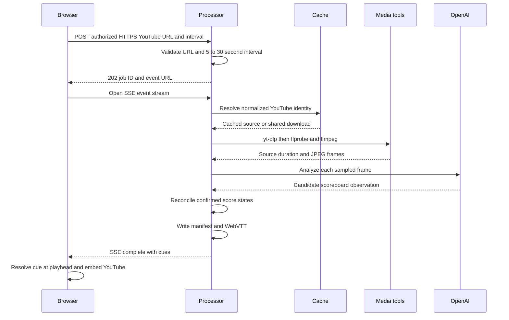

# Video job processing workflow

Score Shield turns a video the operator is authorized to download and analyze into a score-state timeline; it does not alter the source video. The browser is a client of a separate, loopback-bound local processor, while the hosted experience is limited to its UI/demo boundary. See [runtime boundaries](../architecture/runtime-boundaries.md), [media, AI, and hosted UI integration](../integrations/media-ai-and-hosted-ui.md), and the [spoiler-safe score timeline](../concepts/spoiler-safe-score-timeline.md) for the surrounding contracts.

## End-to-end lifecycle



This is the successful path from a submitted URL to a playhead-specific score. Any validation, tool, model, parsing, or reconciliation error instead reaches the terminal `failed` stage and is sent on the same SSE stream.

### Submission, acceptance, and state ownership

The landing form performs an early HTTPS YouTube/`youtu.be` shape check, lets the user select whole-second sampling from 5 through 30, and explicitly reminds them to process only media they are authorized to download and analyze. `ScoreShieldApp` posts `{ sourceUrl, frameIntervalSeconds }` to `POST /api/jobs`; the processor repeats the URL and interval validation instead of trusting the client. Invalid inputs receive `400`; accepted work receives `202` with a UUID, a status URL, and an events URL, then runs asynchronously.

The processor validates a nonblank `OPENAI_API_KEY` before it opens its listener. It binds to `127.0.0.1` and returns CORS headers for `WEB_ORIGIN` (default `http://localhost:3000`), so this is a local-development interface rather than an authenticated or durable job service. The `jobs` map, including SSE clients, progress, and final cues, exists only in process memory: a restart loses status and event access even if artifacts remain on disk. The browser’s Cancel action closes its event stream and returns to the landing page; it does not cancel pipeline execution.

## Progress and terminal outcomes

`processVideo` reports the following ordered stages. The server stores every report in the job and broadcasts `{ id, progress, cues }` to all connected SSE clients; a newly connected client immediately receives the current snapshot.

| Stage | Pipeline producer and useful fields | Consumer behavior |
| --- | --- | --- |
| `downloading` | Cache lookup or `yt-dlp` progress; 0–25% overall | Processing screen shows source-copy progress. A cache hit completes this stage directly. |
| `extracting` | FFprobe duration inspection and FFmpeg output; 25–40% | Shows sampling work and then frame total. |
| `analyzing` | Sequential OpenAI frame calls; 40–88% | Shows processed and total frame counts. |
| `reconciling` | Deterministic candidate confirmation; 90–96% | Shows score-change verification. |
| `exporting` | Manifest and WebVTT writes; 97% onward | Shows metadata-track creation. |
| `complete` | Server attaches final cues and sets 100% | Browser closes SSE, enters the player, and enables its `score.vtt` download link. |
| `failed` | Server catches any rejected pipeline promise | Browser closes SSE and retains the failure message in the processing screen. |

The UI derives elapsed time, optional ETA, percentages, and frame counts from the progress object. Failures can arise before sampling (download/tool start), during media inspection or extraction, while parsing/validating model output, or when reconciliation finds no reliable scoreboard state. The processor preserves the stage where the error occurred, changes only the terminal stage to `failed`, broadcasts it, and logs a safe error record. There is no retry, queue recovery, or cancellation endpoint.

## Source sharing and sampling

### Cache boundary

For recognized YouTube URLs, `sourceCacheKey` extracts the video ID from watch, short, embed, live, or shorts forms, lowercases the hostname, removes a fragment, and hashes the identity `youtube:<video-id>`. Thus equivalent `youtube.com` and `youtu.be` links for one video share `artifacts/cache/youtube/<cache-key>/`; an unrecognized URL identity falls back to its normalized URL string. A non-empty `source.*` that is not a partial download is a cache hit.

On a miss, the module-level `sourceDownloads` map stores the active promise by cache key. Concurrent jobs for the same source wait for that promise rather than launch duplicate downloads; the map entry is removed when it settles. This sharing is in-process only. Once a source path is available, every job independently creates frames, observations, and exports, so its selected interval and current pipeline behavior are reflected in its own outputs.

The downloader is invoked only as `yt-dlp` with an argument array—never through a shell string—and requests a single video rather than a playlist. FFprobe and FFmpeg are likewise executed with argument arrays and optional executable-path overrides. Operational logs record stage, bounded progress, cache key, durations, counts, tool start/completion/failure, and job ID, but intentionally avoid source titles, detected scores, model responses, and secrets. This supports spoiler-safe diagnosis without turning logs into a result channel.

### Sampling rules

`parseFrameInterval` accepts only integer seconds in the inclusive 5–30 range and defaults to 10. A valid request interval overrides `FRAME_INTERVAL_SECONDS` for that job; an omitted API value uses the configured valid value or default. After FFprobe establishes a positive duration, `buildFrameSamplingPlan` applies the requested cadence before the final 120 seconds and a 5-second cadence in that closing window. If the request is already 5 seconds, it remains one 5-second segment. A video no longer than 120 seconds is entirely sampled every 5 seconds.

FFmpeg extracts scaled JPEGs for each plan segment. Rather than treating a frame as located at the segment start, `samplingFrameTimestamp` assigns `(frameIndex + 0.5) * interval` from the segment start and clamps at duration—the midpoint of its sampling bucket. These timestamps become the evidence timestamps used to establish cue transitions.

## From observations to exports

For each JPEG, the pipeline reads the image as base64 and calls the OpenAI Responses API with a constrained request: inspect only a persistent live scoreboard, not replay captions or statistics; return compact JSON; use left/right teams as home/away; and mark an illegible or absent scoreboard as `found=false`. Zod validates the response as a boolean `found`, nullable names and scores, nonnegative integer scores, and confidence from 0 to 1. Observations are processed sequentially, preserving frame order and progress accounting, then saved for the job.

The model supplies candidates, not score truth. Reconciliation chooses stable canonical team labels, corrects observations whose identifiable sides were reversed, and admits only found observations with both scores and confidence at least 0.72. It accepts the first state at time zero, rejects duplicates and regressions, and requires a changed score to be observed again before acceptance. If a newer candidate dominates a pending candidate, the pending state is accepted and the newer state becomes pending, allowing fast consecutive score changes while maintaining monotonicity. With no accepted state, the job fails instead of fabricating a timeline.

Each accepted state is a complete cue: a change starts at the candidate observation timestamp and ends the preceding cue; the final cue ends at the media duration. `cuesToVtt` serializes those contiguous intervals as `WEBVTT` blocks whose payload contains both teams and scores plus confidence.

### Per-job artifact layout and retention

With `ARTIFACTS_DIR` defaulting to `artifacts`, a successful analysis writes the following; a failed job may leave partial files.

```text
artifacts/
  <job-id>/
    frames/
      frame-01-*.jpg
    observations.json
    manifest.json
    score.vtt
  cache/youtube/<cache-key>/
    source.*
```

`manifest.json` records schema version, job ID, submitted source URL, selected interval, closing-window settings, duration, creation time, and reconciled cues. `score.vtt` is the downloadable sidecar; `observations.json` retains validated raw model observations and frames retain visual evidence. The source cache deliberately lives outside the job directory. `npm run artifacts:clean` deletes only immediate UUID-named job directories beneath the chosen artifact root and preserves `cache/` and unrelated directories; it does not implement cache expiry or media eviction. Stop the processor and verify the selected root before cleaning. See the [local processor runbook](../operations/local-processor-runbook.md) for operational procedures.

## Browser completion and spoiler-safe playback

When SSE reports `complete`, the client receives final cues directly, constructs `/api/jobs/<id>/score.vtt` for download, and switches to `PlayerScreen`. `cueAt` binary-searches ordered cue starts and selects the latest cue at or before the YouTube iframe’s current time. The page title and visible score therefore contain only the complete state at the current playhead; seeking recalculates it without listing future events. Playback ending marks the match final, while seeking back before the terminal cue resets that status. The interface initially covers the embedded player, but provider-owned YouTube chrome can still reveal its original title after playback begins; this is a known limitation, not a guarantee that the iframe is spoiler-free.

## Change and test guide

Preserve the server-side URL and 5–30-second validation, closing-window override, midpoint timestamps, normalized source identity, and separate cache/job retention boundary when changing this workflow. A new stage must be added consistently to pipeline reporting, the server’s terminal handling, and the browser stage type/display. A new artifact or cue field also requires coordinating its producer, artifact endpoint, and browser consumer.

`tests/pipeline.test.mjs` is the focused safety net: it covers interval boundaries, final-120-second planning, short-video behavior, midpoint timestamps, equivalent YouTube cache keys, observation schema permissiveness for missing scoreboards, regressions, stable team names, consecutive-change confirmation, final-window confirmation, and WebVTT formatting. Use `npm run test:unit` and `npm run lint` for workflow changes; run `npm test` as well when a browser-facing or build contract changes. [Change validation](../testing/change-validation.md) and the [quickstart](../quickstart.md) provide repository-wide guidance.
