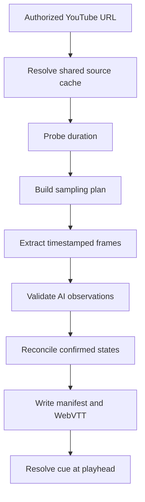

# Score timeline generation and spoiler-safe playback

The score timeline is Score Shield's core product contract: contiguous intervals each carry the complete score known at that point, rather than a list of future events. [Architecture overview](../architecture/overview.md) owns the job/SSE transport around this workflow, and [Testing and source map](../testing-and-source-map.md) maps its deterministic regression suite.

This is the source-to-playback flow; only reconciled cues reach the browser player.

## Sampling and source cache

`parseFrameInterval` accepts whole seconds from 5 through 30 and defaults to 10. A submitted job value overrides `FRAME_INTERVAL_SECONDS`; the processor records the chosen value in `manifest.json`. `buildFrameSamplingPlan(duration, interval)` uses that interval until the last 120 seconds, then samples every 5 seconds. A video at most 120 seconds long is sampled every 5 seconds throughout. `samplingFrameTimestamp` assigns each FFmpeg FPS-filtered frame to the midpoint of its sampling bucket, avoiding a false timestamp at the segment boundary.

`sourceCacheKey` canonicalizes known YouTube identities: equivalent watch and `youtu.be` URLs for the same video ID hash to one cache directory. `processVideo` checks `artifacts/cache/youtube/<key>/` for a non-empty `source.*`; on a miss, the module-level `sourceDownloads` map shares one download promise among concurrent jobs for the same key. Each job still extracts frames and regenerates observations and metadata independently. The cache is intentionally retained by [artifact cleanup](../operations-and-integrations.md#artifact-retention-and-cleanup).

The narrow test names in `tests/pipeline.test.mjs` are **accepts only frame intervals from 5 to 30 seconds**, **samples the final two minutes every 5 seconds**, **timestamps FPS-filtered frames at the center of their sampling buckets**, and **uses one cache entry for equivalent YouTube video URLs**. Run `npm run test:unit` after changing any sampling or cache rule.

## Observations and deterministic reconciliation

`processVideo` runs `yt-dlp`, FFprobe, and FFmpeg with argument arrays, then calls the OpenAI Responses API sequentially for each JPEG. `ObservationSchema` requires `found`, nullable team names and non-negative integer scores, and confidence from 0 to 1. Invalid JSON/schema output, failed tools, missing source frames, absent key, or no reliable state fails the job; the code does not fabricate a timeline.

`reconcileObservations(observations, duration)` first selects stable canonical team labels, normalizes an observation when the model swapped sides, then applies the authoritative acceptance rules:

- observations need a found scoreboard, both scores, and confidence at least `0.72`;
- the first accepted state begins at zero;
- duplicates and any score regression are ignored;
- a changed state is accepted only when a later observation repeats it;
- a different later state that dominates a pending candidate accepts that candidate and becomes the next candidate; and
- each accepted change ends the prior cue at its own candidate timestamp, while the final cue ends at media duration.

This permits rapid consecutive changes without trusting a solitary reading. It also means no sport-specific adjudication is claimed: short states can be missed, and replay detection remains heuristic. Do not move monotonicity, team-side normalization, or cue boundaries into a prompt.

The **keeps team labels stable and confirms fast consecutive score changes** and **confirms the test video's final score from consecutive closing-window frames** tests exercise the complex acceptance path. Add a case before changing confidence, candidate replacement, score-ordering, or team-label rules; `npm run lint` is the accompanying source check.

## Output and playback contract

`manifest.json` has `schemaVersion: "1.0"`, job `id`, original `sourceUrl`, `frameIntervalSeconds`, high-frequency window settings, `duration`, `createdAt`, and complete cue objects. A cue includes `start`, `end`, `{ name, score }` for each side, `confidence`, and `evidenceFrame`. `cuesToVtt` writes ordered `WEBVTT` blocks containing the interval and a JSON payload with complete score state.

The React `cueAt(cues, time)` binary-searches cue starts and renders only that cue. This is why every cue must be ordered, non-overlapping, duration-bounded, and self-contained: direct resume or seek must not replay previous deltas. The UI gets final cues through SSE and exposes the VTT endpoint as a download; it does not parse the VTT or fetch the manifest today. [The architecture page](../architecture/overview.md#browser-interface-and-player) documents the matching player-completion status behavior.

## Safe extension recipe

For a sampling, observation, reconciliation, or serialization change:

1. Start in `server/config.mjs` for cadence/absolute timestamps or `server/pipeline.mjs` for source identity, schema, reconciliation, and export.
2. Preserve the external cue fields and the manifest's selected interval/high-frequency settings unless the UI or another consumer is migrated in the same change.
3. Add the narrow behavioral test in `tests/pipeline.test.mjs`: initial state, duplicates, regression, transition confirmation, terminal window, team-side normalization, interval bounds, or VTT output as applicable.
4. Run `npm run test:unit` and `npm run lint`. `npm test` is conditional only if the UI or hosted build contract changes.

Do not hand-edit generated files under `artifacts/`; rerun processing instead. Escalate to API/UI changes when a new cue field, stage, or VTT download behavior must be visible to consumers.
